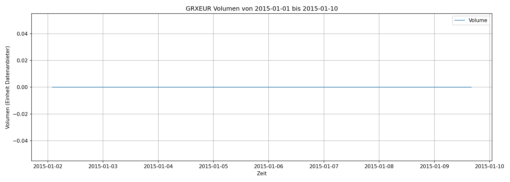

# Experiment Gruppe 3

### Problem Definition

**Target**

Prediction of short-term trend direction for the German equity index (symbol: GRXEUR) over the next  
t = [5, 10, 15, 30, 60] minutes using 1-minute OHLC data.

For every minute in the period 2010-01-01 to 2018-12-31 we compute the linear regression slope of the
future price window of length t and normalize it by the mean price in that window.  
The sign of this normalized slope is used as target (upward vs. downward / flat trend).


**Input Variables**
- open, high, low, close

**Input Features**

- Normalized close price and 1-minute returns
- Normalized exponential moving averages (EMA) over t = [5, 10, 15, 30, 60] minutes
- Slopes and second order slopes of EMAs
- Intraday time features (minute-of-day, day-of-week, hour-of-day)
- Z-normalized price and EMA features

### Procedure Overview

- Use historical 1-minute bar data (OHLC, volume) for GRXEUR from 2010 → 2018.

  (- Clean and unify all yearly ASCII files into a single, time-indexed dataset.)
- Engineer technical features (returns, EMAs, slopes).
- Compute forward-looking trend targets as described above.
- Later: train and evaluate machine learning models to predict short-term trend direction.


## Step 1 - Data Acquisition

We use historical 1-minute bar data for the German equity index (symbol: GRXEUR) for the years 2010–2018.
The data comes as ASCII CSV files exported from a trading data provider.

**Raw Files**

- `DAT_ASCII_GRXEUR_M1_2010.csv`
- `DAT_ASCII_GRXEUR_M1_2011.csv`
- ...
- `DAT_ASCII_GRXEUR_M1_2018.csv`

Each file contains 1-minute OHLC data with the following format (semicolon-separated, no header):

`YYYYMMDD HHMMSS;open;high;low;close;volume`

Example rows from `DAT_ASCII_GRXEUR_M1_2010.csv`:

[data_acquisition.py](scripts/02_data_understanding.py)

```text
20101115 020000;6709.000000;6709.500000;6703.500000;6705.000000;0
20101115 020100;6705.000000;6710.500000;6705.000000;6710.000000;0
20101115 020200;6710.500000;6713.500000;6710.500000;6713.500000;0
20101115 020300;6713.500000;6713.500000;6711.500000;6712.000000;0
20101115 020400;6712.500000;6715.000000;6712.500000;6714.000000;0
```

**Script**

[data_acquisition.py](scripts/02_data_understanding.py)

This script loads the CSV files, converts them into cleaned DataFrames with proper timestamps, and saves each year as an individual Parquet file. 
It then combines all years into one combined dataset and saves that as a full Parquet file as well.

### Approach
No external market data API is used. Instead, we work with already downloaded ASCII CSV files.
A Python script reads all DAT_ASCII_GRXEUR_M1_*.csv files, parses the timestamp and OHLC columns, and combines them into a unified, time-indexed DataFrame.
Timestamps are parsed from YYYYMMDD HHMMSS into a proper datetime column and used as index.
The cleaned data is stored as Parquet files for efficient downstream processing.


## Step 2 – Data Understanding
This step explores the structure and behavior of the GRXEUR price data.
The goal is to understand how the data behaves before building features and training models.

**Script:**[data_understanding.py](experiment/scripts/02_data_understanding/data_understanding.py)
This script loads the cleaned Parquet files, computes descriptive statistics, and visualizes key aspects of the dataset.

### Plots:
**1. Close Prices** (Example: 2015-01-01 to 2015-01-10)


**Interpretation**
The price moves between ~9400 and ~9900 index points during this period.
Strong intraday movement is visible, including sudden drops and recoveries.
Gaps in the line correspond to weekends and holidays, which is expected for index data.
The pattern shows realistic market dynamics: volatility, trends, and short-term fluctuations.
These observations confirm that the timestamp ordering and OHLC values were loaded correctly.

**2. Volume**



**Interpretation**
The volume is 0 for every single minute in the dataset.
This is normal for synthetic or derivative index feeds (like GRXEUR), because indexes do not carry real trading volume.
As a result, the volume column does not contain usable information.
Conclusion: Volume will not be used for feature engineering.

**3. Histogram of 1-Minute Returns**


**Interpretation**
The return distribution is centered very close to 0, meaning most 1-minute price changes are small.
The peak around 0 indicates many “no-movement” or minimal-movement periods.
The distribution has fat tails, which is typical for financial time series:
rare but strong positive or negative price movements.
The shape looks symmetric with slightly heavier density on the left tail, which is also normal.
This confirms that the data behaves like a typical financial intraday time series.

### Descriptive Statistics – Key Observations
**Close Prices**

Median price: around 9700–9800 points depending on the year.
Minimum and maximum values look realistic for the DAX-like GRXEUR index.
No extreme outliers or corrupted values.


**Returns**

Mean return is extremely close to 0, as expected for short intervals.
Standard deviation of returns reflects normal market volatility.
A few strong jumps exist, but they are rare and plausible (market openings, news events).


**Timestamps**

All data is chronologically ordered.
Regular gaps correspond to non-trading hours.
No duplicate timestamps detected.

### Findings
Data quality is good: the dataset is clean, chronologically consistent, and contains realistic price movements.
Volume is meaningless in this dataset and will be excluded from modeling.
Returns behave as expected for an intraday financial time series: centered around zero, heavy-tailed, and symmetric.
Close price behavior matches normal DAX-like index dynamics, including volatility clusters and day-to-day patterns.
This analysis confirms that the dataset is suitable for the next phase.


## Step 3 – Pre-Split Data Preparation

This step prepares the data for machine learning by computing technical features and forward-looking trend targets, then splitting the data chronologically.

**Script:** [main.py](experiment/scripts/03_pre_split_prep/main.py)

### Targets

For each prediction period t = [5, 10, 15, 30, 60] minutes, we compute:
- **Normalized Trend Slope**: Linear regression slope of the future price window, normalized by mean price
- **Trend Direction**: Sign of normalized slope (+1 upward, -1 downward, 0 flat)

This creates 10 target columns: `target_trend_{t}m` and `target_direction_{t}m` for each period.

### Features

The script generates 27 technical features:
- Normalized close price and 1-minute returns
- Exponential Moving Averages (EMA) for periods [5, 10, 15, 30, 60] minutes (normalized and z-normalized)
- First and second-order slopes of EMAs
- Price range, intraday time features (minute-of-day, day-of-week, hour-of-day)

All features use only past/present data (no lookahead bias).

### Data Splits

The data is split chronologically:
- **Train**: 2010-01-01 to 2016-12-31 (7 years)
- **Validation**: 2017-01-01 to 2017-12-31 (1 year)
- **Test**: 2018-01-01 to 2018-12-31 (1 year)

### Output

Processed datasets are saved to `experiment/data/processed/`:
- `GRXEUR_train.parquet`, `GRXEUR_validation.parquet`, `GRXEUR_test.parquet`
- `features.txt` (list of feature names)

Each file contains OHLC data, all 27 features, all 10 targets, with missing values removed.